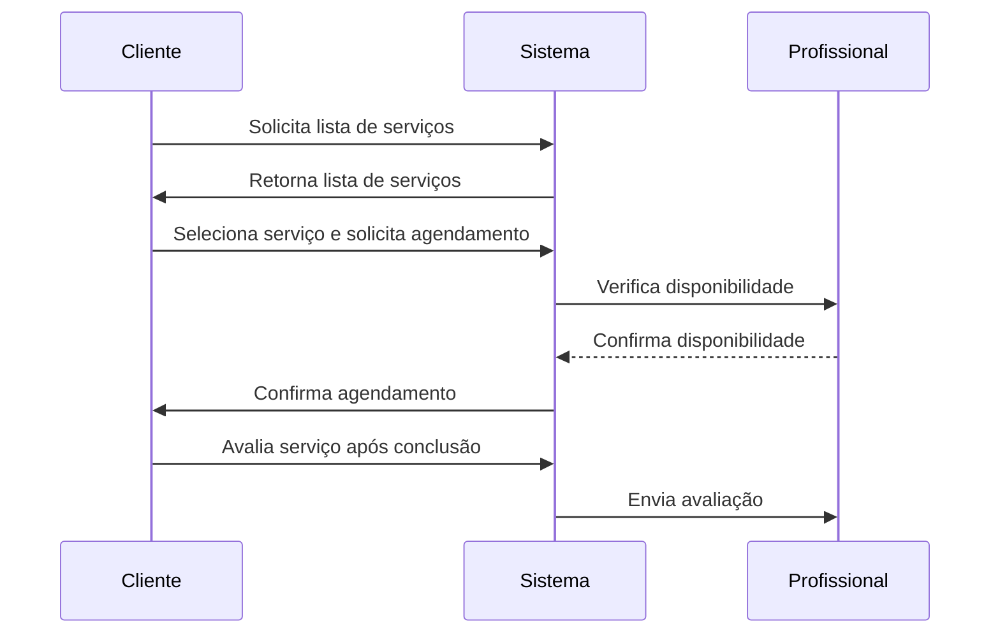
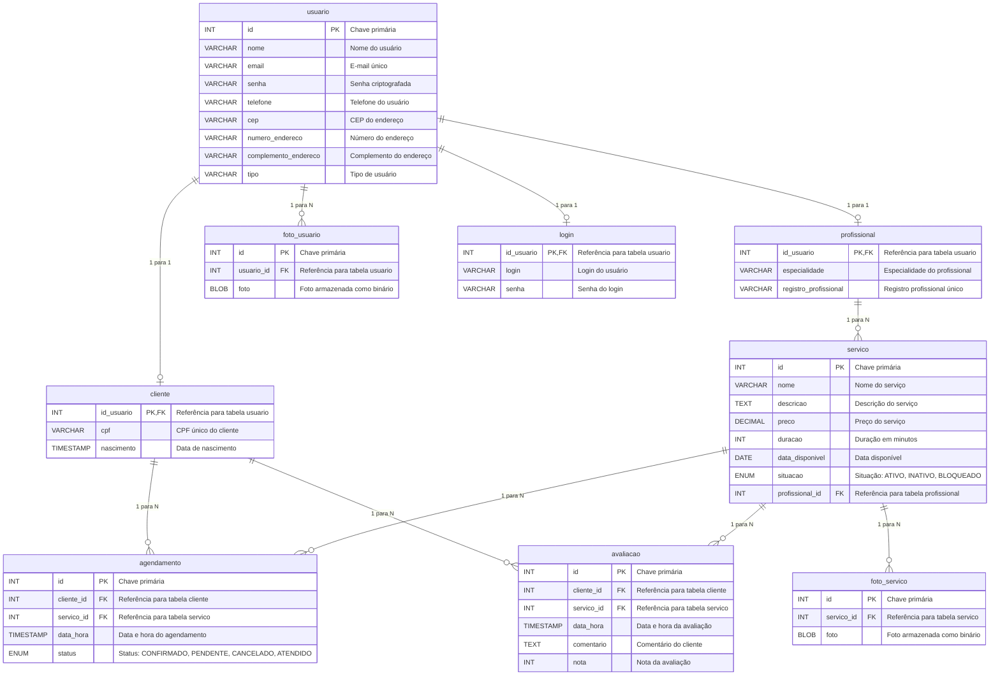
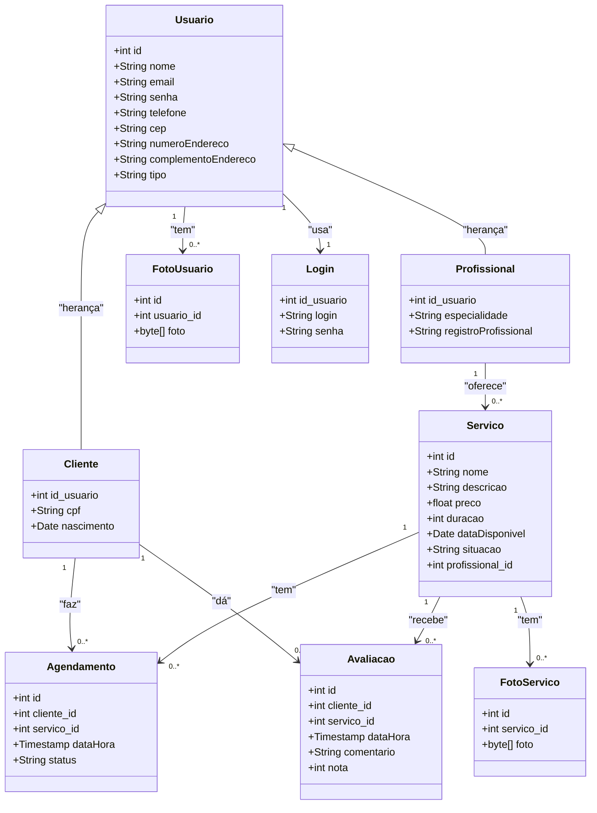

<div align="center">

</div>


<h1 align="center"> Elysium Project </h1>


## Estrutura do Projeto
### Tecnologias Utilizadas:
- Maven: Gerenciador de dependências.
- Lombok: Para reduzir boilerplate (getters, setters, etc.).
- Spring Boot: Framework para criar a API REST.
- Spring Web: Crie aplicativos web, incluindo RESTful, usando Spring MVC e Apache Tomcat como o contêiner incorporado padrão.
- Spring Data JPA: Para persistência de dados.
- Banco H2: Banco de dados em memória, ideal para desenvolvimento e testes.
- Heroku: Plataforma para publicação.
- Usaremos MVC (Model-View-Controller) para organizar as camadas do sistema.


### Comportamento Esperado do Projeto

O projeto Elysium é uma aplicação de agendamento de serviços que permite a interação entre clientes e profissionais. Abaixo estão os comportamentos esperados do sistema:

1. **Cadastro de Usuários**:
    - Clientes e profissionais podem se cadastrar fornecendo informações pessoais e de contato.
    - Cada usuário deve ter um login único e uma senha segura.

2. **Gerenciamento de Serviços**:
    - Profissionais podem criar, atualizar e excluir serviços que oferecem.
    - Serviços devem incluir detalhes como nome, descrição, preço, duração e disponibilidade.

3. **Agendamento de Serviços**:
    - Clientes podem visualizar a lista de serviços disponíveis e agendar um serviço.
    - O sistema deve permitir a seleção de data e hora para o agendamento.
    - Agendamentos podem ser confirmados, cancelados ou marcados como atendidos.

4. **Avaliação de Serviços**:
    - Após a conclusão de um serviço, clientes podem avaliar o serviço prestado.
    - Avaliações devem incluir uma nota e um comentário.

5. **Gerenciamento de Imagens**:
    - Usuários e serviços podem ter imagens associadas a eles.
    - Imagens podem ser enviadas e recuperadas através de endpoints específicos.

6. **Autenticação e Autorização**:
    - O sistema deve garantir que apenas usuários autenticados possam acessar funcionalidades protegidas.
    - Diferentes tipos de usuários (clientes e profissionais) devem ter permissões adequadas às suas funções.

7. **Persistência de Dados**:
    - Dados devem ser armazenados de forma persistente utilizando o banco de dados H2 durante o desenvolvimento e testes.
    - Para produção, o sistema deve ser configurado para utilizar um banco de dados adequado.

8. **Desempenho e Escalabilidade**:
    - A aplicação deve ser capaz de lidar com múltiplas requisições simultâneas.
    - Deve ser possível escalar a aplicação horizontalmente para suportar um número crescente de usuários.

Esses comportamentos garantem que o sistema funcione de maneira eficiente e atenda às necessidades dos usuários finais.

### Diagrama de Casos de Uso

```mermaid
%% Diagrama de Casos de Uso para o projeto Elysium
%% Representa as interações entre os atores e os casos de uso do sistema

%% Definição dos atores
actor Cliente
actor Profissional
actor Administrador

%% Definição dos casos de uso
usecase UC1 as "Cadastro de Usuários"
usecase UC2 as "Gerenciamento de Serviços"
usecase UC3 as "Agendamento de Serviços"
usecase UC4 as "Avaliação de Serviços"
usecase UC5 as "Gerenciamento de Imagens"
usecase UC6 as "Autenticação e Autorização"
usecase UC7 as "Persistência de Dados"
usecase UC8 as "Desempenho e Escalabilidade"

%% Relacionamentos entre atores e casos de uso
Cliente --> UC1
Cliente --> UC3
Cliente --> UC4
Cliente --> UC5
Cliente --> UC6

Profissional --> UC1
Profissional --> UC2
Profissional --> UC5
Profissional --> UC6

Administrador --> UC1
Administrador --> UC2
Administrador --> UC3
Administrador --> UC4
Administrador --> UC5
Administrador --> UC6
Administrador --> UC7
Administrador --> UC8
```


### Diagrama de Sequência

Diagrama de sequência para o processo de agendamento de um serviço:



### Diagrama de ER
Diagrama de ER do esquema do banco de dados gerado em Mermaid:


### Diagrama de Classes

Diagrama de classes do projeto gerado em Mermaid:

Além da modelagem das entidades de domínio e seus relacionamentos tabém utilizou-se de classes auxiliares para representar a estrutura do projeto:

- DTO (Data Transfer Object): Usado para transferir dados entre camadas da aplicação.
- Repository: Responsável pela interação com a camada de persistência (banco de dados).
- Service: Contém a lógica de negócios da aplicação.
- Controller: Gerencia as requisições HTTP e direciona para os serviços apropriados.
- Exception: Define classes de exceção personalizadas para tratamento de erros específicos.



### Explicação do Diagrama

#### Tabelas principais:
- **usuario**: Base de todas as entidades, representando informações compartilhadas entre clientes e profissionais.
- **cliente** e **profissional**: Estendem a tabela usuario com atributos específicos para cada tipo de usuário.
- **servico**: Associado a um profissional, detalha os serviços oferecidos.
- **agendamento**: Representa os agendamentos feitos pelos clientes para os serviços oferecidos.
- **avaliacao**: Contém as avaliações feitas pelos clientes sobre os serviços.
- **foto_usuario** e **foto_servico**: Tabelas separadas para armazenar imagens relacionadas aos usuários e serviços, respectivamente.
- **login**: Armazena as informações de login dos usuários.

#### Relacionamentos:
- **usuario** é pai de **cliente** e **profissional** (herança 1-para-1).
- **profissional** está relacionado a **servico** (1-para-muitos).
- **cliente** está relacionado a **agendamento** (1-para-muitos).
- **servico** está relacionado a **agendamento** (1-para-muitos).
- **cliente** está relacionado a **avaliacao** (1-para-muitos).
- **servico** está relacionado a **avaliacao** (1-para-muitos).
- **usuario** está relacionado a **foto_usuario** (1-para-muitos), permitindo múltiplas imagens por usuário.
- **servico** está relacionado a **foto_servico** (1-para-muitos), permitindo múltiplas imagens por serviço.
- **usuario** está relacionado a **login** (1-para-1).

Esse diagrama documenta claramente o modelo de dados e pode ser usado como referência para o desenvolvimento e comunicação do projeto.


### Configurando a porta da aplicação
A aplicação ComfortAid usa a porta 5000 por padrão, pode-se fazer uma das seguintes configurações:

- a) Configuração direta ao executar o .jar

Especifique a porta desejada ao iniciar sua aplicação:
``` bash
java -jar comfortaid-0.0.1-SNAPSHOT.jar --server.port=80
```
- b) Configuração no arquivo `application.properties`

No arquivo `src/main/resources/application.properties`, configure a porta:
``` properties
server.port=80
```
Após isso, gere novamente o arquivo .jar com:
``` bsah
mvn clean package
```

>   No Linux ou macOS, você precisa de privilégios de superusuário para que uma aplicação acesse portas abaixo de 1024, como a 80. No terminal, você deve usar o comando sudo ao iniciar sua aplicação:
> ``` bash
> sudo java -jar comfortaid-0.0.1-SNAPSHOT.jar --server.port=80
>``` 

### Teste com Postman
Você pode testar os seguintes endpoints no Postman:

GET /api/servicos - Listar todos os serviços.
GET /api/servicos/{id} - Buscar um serviço por ID.
POST /api/servicos - Criar um novo serviço.
``` json
{
    "nome": "Massagem Boa",
    "descricao": "Uma massagem relaxante de 60 minutos.",
    "preco": 100.0,
    "duracao": "60",
    "profissional": {
        "id": 1
    }
}
```

PUT /api/servicos/{id} - Atualizar um serviço existente.
DELETE /api/servicos/{id} - Excluir um serviço.


POST http://localhost:8080/api/profissionais
``` json
{
        "nome": "Emy Eiras",
        "email": "Emy@gmail.com",
        "senha": "senha444",
        "telefone": "(48) 98888-4444",
        "cep": "88020-444",
        "numeroEndereco": "444",
        "complementoEndereco": "Sala",
        "especialidade": "Fisioterapeuta",
        "registroProfissional": "REG44444"
    }
```
POST http://localhost:8080/api/clientes
``` json
{
        "nome": "Dani Damares",
        "email": "dani@gmail.com",
        "senha": "senha333",
        "telefone": "(48) 98888-3333",
        "cep": "88020-333",
        "numeroEndereco": "333",
        "complementoEndereco": "Casa",
        "cpf": "98765432333"
    }
```
POST http://localhost:8080/api/agendamentos
``` json
{
    "cliente": {
        "id": 1
    },
    "servico": {
        "id": 1
    },
    "dataHora": "2024-01-12T10:00:00"
}
```
### Criar um novo Profissional
curl -X POST http://localhost:5000/profissionais -H "Content-Type: application/json" -d '{
"nome": "Clara Clarinete",
"email": "clara@mail.com",
"senha": "senha22",
"telefone": "(48) 98888-2222",
"cep": "88020-222",
"numeroEndereco": "222",
"complementoEndereco": "Sala22",
"tipo": "profissional",
"especialidade": "Fitoterapia",
"registroProfissional": "REG2012"
}'
Resposta:
{"id":16,"nome":"Clara Clarinete","email":"clara@mail.com","telefone":"(48) 98888-2222","especialidade":"Fitoterapia","registroProfissional":"REG2012"}%

### Enviar uma imagem para um cliente
Você pode usar o curl para enviar uma imagem para o endpoint /api/imagens/cliente/{id}:
''' bash

curl -X POST "http://localhost:8080/api/imagens/cliente/1" -H "Content-Type: multipart/form-data" -F "foto=@/path/to/your/image.jpg"
'''
### Enviar uma imagem para um profissional
Da mesma forma, você pode enviar uma imagem para o endpoint /api/imagens/profissional/{id}:
''' bash

curl -X POST "http://localhost:8080/api/imagens/profissional/1" -H "Content-Type: multipart/form-data" -F "foto=@/path/to/your/image.jpg"
'''

### Recuperar uma imagem de um cliente
Para recuperar a imagem de um cliente, você pode fazer uma requisição GET para o endpoint /api/imagens/cliente/{id}:
''' bash

curl -X GET "http://localhost:8080/api/imagens/cliente/1" --output cliente_foto.jpg
'''
### Recuperar uma imagem de um profissional
Para recuperar a imagem de um profissional, você pode fazer uma requisição GET para o endpoint /api/imagens/profissional/{id}:
''' bash

curl -X GET "http://localhost:8080/api/imagens/profissional/1" --output profissional_foto.jpg
'''
> Esses exemplos mostram como você pode interagir com os endpoints para enviar e recuperar imagens usando curl. Certifique-se de substituir /path/to/your/image.jpg pelo caminho real da imagem que você deseja enviar.

> Também é possível usar o [postman](https://cursos.alura.com.br/forum/topico-envio-de-foto-via-postman-197419#:~:text=Com%20a%20API%20em%20execução,a%20requisição%20do%20tipo%20POST.)

# Author

| [<br><sub>Carlos Hayden</sub>](https://github.com/JunhaumHayden) |
| :---: |

