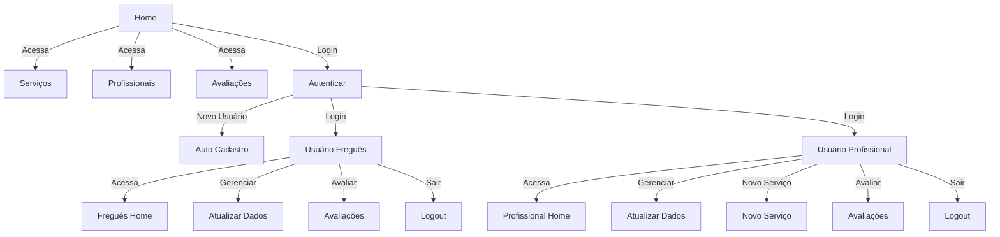

<div align="center">

</div>


<h1 align="center"> Elysium APP Project </h1>


  

  
  


## Descrição do Projeto

> A aplicação pode ser acessada pela [Web page](https://junhaumhayden.github.io/Elysium_APP_Project/)

> Um pequeno um vídeo de demonstração do aplicativo pode ser visualizado no [youtube](https://youtu.be/bbU-9l1c2Ss)

### 📌 Sobre o Projeto

Elysium é uma aplicação desenvolvida para conectar clientes a profissionais que oferecem serviços de massagem terapêutica e estética domiciliar. O aplicativo permite que os usuários busquem serviços por região, agendem atendimentos e avaliem os profissionais cadastrados. Além disso, possibilita que profissionais da área divulguem seus serviços, incluindo especialistas em conhecimentos tradicionais, como parteiras e curandeiras.

### 🔍 Comportamento Esperado

- Os usuários podem se cadastrar como clientes ou profissionais.

- Clientes podem navegar pelos serviços disponíveis, visualizar avaliações, cadastrar-se e agendar atendimentos com profissionais.

- Os profissionais podem gerenciar seu perfil, cadastrar novos serviços e receber agendamentos, definir horários de atendimento e receber avaliações dos clientes.

- Ambas as categorias podem acessar o histórico de avaliações e modificar seus dados pessoais.

- O sistema utiliza autenticação por sessão para garantir que cada usuário acesse apenas as funcionalidades adequadas ao seu perfil.

- O aplicativo funciona como uma SPA (Single Page Application) para navegação dinâmica e fluida.

- Implementação de PWA (Progressive Web App) para permitir instalação no dispositivo e uso offline parcial.

### 🛠️ Tecnologias Utilizadas

- `Frontend`: HTML, CSS, JavaScript (ES6+), Bootstrap

- `Frameworks e Bibliotecas`: Axios para requisições HTTP, FontAwesome para ícones

- `Arquitetura`: SPA (Single Page Application), PWA (Progressive Web App), LocalStorage / SessionStorage (persistência de autenticação)

- `Backend`: API REST desenvolvida em Java com Spring Boot, JPA/Hibernate (persistência de dados)

- `Banco de Dados`: H2 (ambiente de desenvolvimento) e MySQL (ambiente de produção)

#### Ferramentas de Desenvolvimento

- Git e GitHub (controle de versão)

- VS Code / IntelliJ IDEA

- Postman (testes de API)

###  🔀 Fluxo de Navegação das Telas



### 📂 Estrutura do Projeto
```
/confortaid_project
├── index.html              # Página principal
├── Elysium_user_env.html # Página de login/cadastro
├── /assets                 # Recursos do projeto
│   ├── /css                # Estilos CSS
│   ├── /html               # Páginas secundárias
│   │   └── presentation.html # Página de apresentação
│   └── /js                 # Scripts JavaScript
│       └── script.js       # Lógica de frontend
```


### Função de Cada Arquivo


- **index.html**: Página principal da aplicação, redireciona usuários não autenticados para login.

- **Elysium_user_env.html**: Interface para login e cadastro de usuários.

- **/assets/css**: Contém os estilos da aplicação.

- **/assets/html/presentation.html**: Arquivo HTML que representa a página de apresentação do serviço.

- **/assets/js/script.js**: Lida com funcionalidades da interface, como eventos e interações do usuário.

- **/assets/js/main.js**: Controla a inicialização da aplicação e manipulação de sessões.

- **/assets/js/service-worker.js**: Implementa funcionalidades de PWA, como cache offline e melhoria de desempenho.

- **manifest.json**: Define as configurações da aplicação como PWA, incluindo ícones e configurações de exibição.


# Author

| [<br><sub>Carlos Hayden</sub>](https://github.com/JunhaumHayden) |
| :---: |
